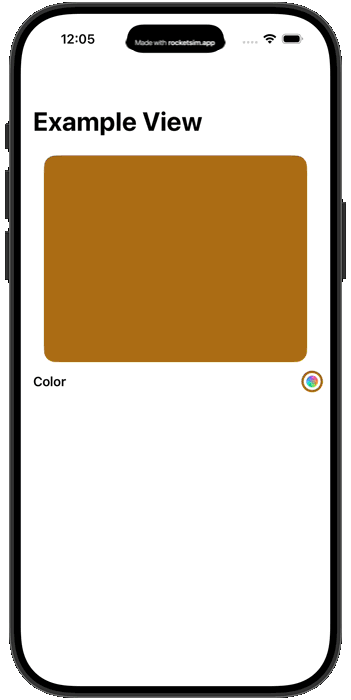

<div align="center">


</div>

<h1 align="center">ChromaPicker</h1>

<div align="center">


A SwiftUI package that gives you a new and improved color picker.

</div>

## Table Of Contents

 <ol>
    <li><a href="#about">About</a></li>
    <li><a href="#features">Features</a></li>
    <li><a href="#examples">Examples</a></li>
    <li><a href="#installation">Installation</a></li>
    <li><a href="#usage">Usage</a></li>
    <li><a href="#contributing">Contributing</a></li>
    <li><a href="#license">License</a></li>
</ol>

## About

ChromaPicker is a highly performant, native SwiftUI color picking package designed for modern IOS applications. Built from the ground up to support both single color and complex gradient selections, it features a buttery-smooth 2D interactive grid pad, dynamic live-reordering gradient stops, and seamless orientation adaptation. 

## Features

-  Single color and complex gradient selections 
-  Inspired and modern design
-  Custom sliders
-  HSV, RGB, and HEX color models
-  Input fields for easy access 
-  Seamless setup and configuration

## Examples

<div style="display:flex; justify-content:center; gap:20px; text-align:center;">
  <div>
    <h3>Single Selection</h3>
    
  </div>

  <div>
    <h3>Stops Selection</h3>
    
  </div>
</div>

## Installation 

### Requirements

Swift: `>=6.2.4`

Xcode: `>=26.3`

iOS: `>=26.0`

### Swift Package Manager (Xcode)

1. In Xcode, go to **File > Add Packages...**
2. Enter the repository URL: `https://github.com/elyangutierrez/ChromaPicker.git`
3. Choose the version rule you want (e.g., "Up to Next Major Version") and click **Add Package**.

### Swift Package Manager (Package.swift)
If you are building your own Swift Package, add ChromaPicker as a dependency in your `Package.swift` file:

```swift
dependencies: [
    .package(url: "https://github.com/elyangutierrez/ChromaPicker.git", from: "1.0.0")
]
```

Then, add it to your target's dependencies:

```swift
.target(
    name: "YourTarget",
    dependencies: ["ChromaPicker"]
)
```

## Usage

To use ChromaPicker in your projects, follow the steps down below:


Import ChromaPicker to your file:

```swift
import ChromaPicker
```

Create a `@State` variable for your selection:

```swift
@State private var color: Color = .red
```

or

```swift
@State private var stops: [Gradient.Stop] = [
  .init(color: .blue, location: 0.2),
  .init(color: .red, location: 0.5),
  .init(color: .green, location: 0.7)
]
```

Then add ChromaPicker to your view:

```swift
ChromaPicker(selection: $color)
```

or

```swift
ChromaPicker(selection: $stops)
```

For more customization, you can customize the picker to your liking:

```swift
ChromaPicker(selection: $color, supportsAlpha: false, canSaveColors: false)
```

## Contributing

For more information about contributing, please read [CONTRIBUTING](./CONTRIBUTING.md).

## License

This package uses the `MIT License`. For more information, please read [LICENSE](./LICENSE).